# Greenplum Academy Loop

Этот контур превращает урок из набора материалов в повторяемый тренажер.

## Flow

```mermaid
flowchart LR
    A["Pre-assessment"] --> B["Lesson runner"]
    B --> C["Practice + hints"]
    C --> D["EXPLAIN Analyzer"]
    D --> E["EXPLAIN Visualizer"]
    E --> F["Runtime diagnostics"]
    F --> G["Random scenario"]
    G --> H["Submit evidence"]
    H --> I["Adaptive review"]
    I --> J["Telemetry + next challenge"]
```



## Commands

```bash
python3 mentor-lab.py assessment greenplum pre
python3 mentor-lab.py lesson greenplum
python3 mentor-lab.py hint greenplum physical-joins --level 2
python3 mentor-lab.py analyze-plan greenplum --query bad_customer_join
python3 mentor-lab.py visualize-plan greenplum --query product_join --sample --format html --output artifacts/product-plan.html
python3 mentor-lab.py diagnostics greenplum list
python3 mentor-lab.py incident start greenplum slow-product-analytics
python3 mentor-lab.py scenario greenplum start --difficulty medium --seed 42 --dry-run
python3 mentor-lab.py submit greenplum advanced-joins
python3 mentor-lab.py review greenplum --submission submissions/advanced-joins.md
python3 mentor-lab.py adaptive-review greenplum --submission submissions/advanced-joins.md
python3 mentor-lab.py cockpit greenplum
python3 mentor-lab.py control-room greenplum
python3 mentor-lab.py telemetry greenplum --pre 40 --post 85 --review 70
python3 mentor-lab.py certificate greenplum
```

## What It Automates

- **Assessment**: быстрый pre/post с answer key и score.
- **Adaptive hints**: можно показать все подсказки или конкретный уровень.
- **EXPLAIN Analyzer**: выделяет Motion, join algorithms, slices, hash keys и risks.
- **EXPLAIN Visualizer**: рисует Mermaid/HTML карту coordinator, interconnect, Motion и joins.
- **Runtime diagnostics**: дает probes для skew, active queries, statistics и spill-risk.
- **Scenario randomizer**: выдает replayable hidden scenario по difficulty и seed.
- **Hidden incidents**: новые сценарии без заранее очевидного ответа.
- **Submit/adaptive review**: ученик сдает evidence, ментор получает score, missing evidence и next task.
- **Cockpit / control room**: локальные HTML-страницы для ученика и ментора.
- **Telemetry**: growth report по pre/post/review.
- **Certificate**: completion artifact с score, level и next challenge.

Подробный v2-маршрут: [academy-v2.md](academy-v2.md).

## Mentor Rule

Не подсказывай решение до evidence. Хороший ответ ученика должен содержать:

- SQL или EXPLAIN fragment;
- измерение `gp_segment_id` там, где есть skew hypothesis;
- объяснение physical cause;
- validation после изменения.
