# Контур Greenplum Academy

Этот контур превращает урок из набора материалов в повторяемый тренажер.

## Поток Работы

```mermaid
flowchart LR
    A["Readiness Pro"] --> B["Pre-assessment"]
    B --> C["Live Orchestrator"]
    C --> D["Teach mode"]
    D --> E["Practice + hints"]
    E --> F["Observation trail"]
    F --> G["EXPLAIN Coach"]
    G --> H["EXPLAIN Visualizer"]
    H --> I["Runtime diagnostics"]
    I --> J["Random scenario"]
    J --> K["Evidence pack"]
    K --> L["SQL autograder"]
    L --> M["Misconception diagnosis"]
    M --> N["Homework autograder"]
    N --> O["Adaptive review"]
    O --> P["Debrief"]
    P --> Q["Learning Loop report"]
    Q --> R["Replay pack"]
    R --> S["Live smoke"]
    S --> T["Next challenge"]
```



## Команды

```bash
python3 mentor-lab.py readiness greenplum --platform macos
python3 mentor-lab.py assessment greenplum pre
python3 mentor-lab.py lesson greenplum
python3 mentor-lab.py teach greenplum simple --stage 1
python3 mentor-lab.py orchestrate greenplum --route simple --stage 1 --mode recovery
python3 mentor-lab.py portal greenplum --version v2 --output artifacts/greenplum-student-portal-v2.html
python3 mentor-lab.py hint greenplum physical-joins --level 2
python3 mentor-lab.py analyze-plan greenplum --query bad_customer_join
python3 mentor-lab.py coach-plan greenplum --query bad_customer_join --sample
python3 mentor-lab.py visualize-plan greenplum --query product_join --sample --format html --output artifacts/product-plan.html
python3 mentor-lab.py diagnostics greenplum list
python3 mentor-lab.py observe greenplum start --output artifacts/greenplum-observe-checklist.md
python3 mentor-lab.py incident start greenplum slow-product-analytics
python3 mentor-lab.py scenario greenplum start --difficulty medium --seed 42 --dry-run
python3 mentor-lab.py dataset greenplum generate --scale small --seed 42 --skew high --late-facts --wide-rows --output artifacts/generated-enterprise.sql
python3 mentor-lab.py evidence greenplum collect redistribute-join --output submissions/redistribute-join.md
python3 mentor-lab.py misconception greenplum diagnose --text "partition key это то же самое что distribution key"
python3 mentor-lab.py homework greenplum check --submission submissions/homework.md
python3 mentor-lab.py autograde-sql greenplum --submission labs/greenplum/examples/student-solution-example.sql --output artifacts/sql-autograde.md
python3 mentor-lab.py calibration greenplum show senior
python3 mentor-lab.py submit greenplum advanced-joins
python3 mentor-lab.py review greenplum --submission submissions/advanced-joins.md
python3 mentor-lab.py adaptive-review greenplum --submission submissions/advanced-joins.md
python3 mentor-lab.py cockpit greenplum
python3 mentor-lab.py control-room greenplum
python3 mentor-lab.py debrief greenplum --student Иван --submission submissions/advanced-joins.md --pre 40 --post 85 --output artifacts/greenplum-debrief.md
python3 mentor-lab.py telemetry greenplum --pre 40 --post 85 --review 70
python3 mentor-lab.py learning-loop greenplum --pre 40 --post 85 --submission submissions/advanced-joins.md --output artifacts/greenplum-learning-loop.md
python3 mentor-lab.py replay greenplum --student Иван --submission submissions/advanced-joins.md --pre 40 --post 85 --output artifacts/greenplum-replay.md
python3 mentor-lab.py ci-smoke greenplum --dry-run
python3 mentor-lab.py certificate greenplum
```

## Что Автоматизируется

- **Assessment**: быстрый pre/post с answer key и score.
- **Readiness Pro**: platform-specific подготовка macOS, Windows и Linux до урока.
- **Live Orchestrator**: mode-aware stage, timer, decision gate и next action для ментора.
- **Teach mode**: stage-by-stage view для ментора: слайды, речь, команды, вопрос, expected answer и evidence checkpoint.
- **Adaptive hints**: можно показать все подсказки или конкретный уровень.
- **EXPLAIN Analyzer**: выделяет Motion, join algorithms, slices, hash keys и risks.
- **Query Plan Coach**: объясняет MPP-план через root cause hypothesis и следующий SQL.
- **EXPLAIN Visualizer**: рисует Mermaid/HTML карту coordinator, interconnect, Motion и joins.
- **Runtime diagnostics**: дает probes для skew, active queries, statistics и spill-risk.
- **Live Lab Observation**: создает checklist и report по evidence trail ученика.
- **Scenario randomizer**: выдает replayable hidden scenario по difficulty и seed.
- **Scenario Pack v2**: добавляет production-инциденты AOCO mutable dimension и coordinator result-set bottleneck.
- **Dataset Generator Pro**: генерирует deterministic SQL datasets с scale, skew, late facts и wide rows.
- **Hidden incidents**: новые сценарии без заранее очевидного ответа.
- **Evidence capture**: создает submission-ready markdown pack с командами и секциями для RCA.
- **Real SQL Autograder**: проверяет SQL submission по physical design и executable evidence.
- **Misconception bank**: ловит типичные ошибки и дает вопрос, мини-эксперимент, hint и follow-up.
- **Homework autograder**: проверяет домашку по физическому дизайну и evidence-first контракту.
- **Calibration examples**: weak/solid/senior ответы для единых ожиданий качества.
- **Submit/adaptive review**: ученик сдает evidence, ментор получает score, missing evidence и next task.
- **Debrief**: генерирует сообщение ученику, misconceptions и private mentor notes.
- **Cockpit / control room**: локальные HTML-страницы для ученика и ментора.
- **Telemetry**: growth report по pre/post/review.
- **Learning Loop**: итоговая карта навыков, gaps по evidence и интервальная практика на +1/+3/+7 дней.
- **Replay pack**: объединяет debrief, learning loop и подготовку к Lesson 02.
- **Greenplum Live Smoke**: фиксирует локальный и GitHub Actions контур живой проверки стенда.
- **Certificate**: completion artifact с score, level и next challenge.
- **Academy Experience v5**: stateful session, Vue 3 + Nuxt 3 + Vite portal, timeline, skill graph и lesson-doctor pre-flight.

## Academy Experience v5

Новый основной маршрут запускает занятие как session, а не как набор разрозненных команд. `apps/academy-portal` читает `session.json`, показывает current stage, skill graph и copy-command кнопки, а ментор в конце получает session report.

```bash
python3 mentor-lab.py session greenplum start --student Иван --output artifacts/sessions/ivan
MENTOR_LAB_SESSION=artifacts/sessions/ivan/session.json npm --prefix apps/academy-portal run dev
python3 mentor-lab.py session greenplum report --session artifacts/sessions/ivan --output artifacts/greenplum-session-report.md
python3 mentor-lab.py lesson-doctor greenplum --output artifacts/greenplum-lesson-doctor.md
```

Подробный v2-маршрут: [academy-v2.md](academy-v2.md).

## Mentor Rule

Не подсказывай решение до evidence. Хороший ответ ученика должен содержать:

- SQL или EXPLAIN fragment;
- измерение `gp_segment_id` там, где есть skew hypothesis;
- объяснение physical cause;
- validation после изменения.
