# Greenplum Academy v2

Academy v2 превращает первый урок в управляемый тренажер: ученик работает через локальный портал, ментор видит control room, а качество ответа проверяется evidence-first рубрикой.

## Поток Работы

```mermaid
flowchart LR
    A["Student portal"] --> B["Pre-assessment"]
    B --> C["Teach mode"]
    C --> D["Lesson + query tuning lab"]
    D --> E["EXPLAIN visualizer"]
    E --> F["Runtime diagnostics"]
    F --> G["Random scenario"]
    G --> H["Timed challenge"]
    H --> I["Evidence pack"]
    I --> J["Misconception diagnosis"]
    J --> K["Homework autograder"]
    K --> L["Adaptive review"]
    L --> M["Debrief"]
    M --> N["Telemetry report"]
    N --> O["Learning Loop report"]
    O --> P["Certificate / next module"]
```



## Маршрут Ученика

```bash
python3 mentor-lab.py portal greenplum --version v2 --output artifacts/greenplum-student-portal-v2.html
python3 mentor-lab.py assessment greenplum pre
python3 mentor-lab.py visualize-plan greenplum --query product_join --sample --format html --output artifacts/product-plan.html
python3 mentor-lab.py diagnostics greenplum list
python3 mentor-lab.py scenario greenplum start --difficulty medium --seed 42 --dry-run
python3 mentor-lab.py challenge greenplum start --difficulty hard --minutes 15 --seed 7
python3 mentor-lab.py submit greenplum query-tuning
python3 mentor-lab.py evidence greenplum collect redistribute-join --output submissions/redistribute-join.md
python3 mentor-lab.py misconception greenplum diagnose --text "partition key это то же самое что distribution key"
```

## Маршрут Ментора

```bash
python3 mentor-lab.py control-room greenplum --output artifacts/greenplum-control-room.html
python3 mentor-lab.py teach greenplum simple --stage 1
python3 mentor-lab.py diagnostics greenplum show segment-skew
python3 mentor-lab.py solutions greenplum show redistribute-join
python3 mentor-lab.py homework greenplum check --submission submissions/homework.md
python3 mentor-lab.py adaptive-review greenplum --submission submissions/query-tuning.md
python3 mentor-lab.py debrief greenplum --student Иван --submission submissions/query-tuning.md --pre 40 --post 85 --output artifacts/greenplum-debrief.md
python3 mentor-lab.py telemetry greenplum --pre 40 --post 85 --review 70
python3 mentor-lab.py learning-loop greenplum --pre 40 --post 85 --submission submissions/query-tuning.md --output artifacts/greenplum-learning-loop.md
```

## Scenario DSL

Сценарии описываются engine-neutral контрактом: skills, tasks, checks и acceptance criteria. Это позволит тем же способом добавить ClickHouse, Postgres, HDFS, Spark on YARN и Spark on Kubernetes.

```bash
python3 mentor-lab.py dsl greenplum list
python3 mentor-lab.py dsl greenplum show redistribute-join
```

## Контракт Evidence

Хорошая работа ученика должна содержать:

- symptom;
- plan evidence;
- segment or runtime evidence;
- physical cause;
- change;
- validation;
- residual risk.

## Что Делает Это Профессиональным

- **Interactive portal**: ученик видит маршрут урока и команды без ручного поиска по документации.
- **Student Portal v2**: добавляет progress, evidence checklist, misconception hints и export-ready submission draft.
- **Teach mode**: ментор получает один stage-oriented экран вместо ручной навигации по документам.
- **EXPLAIN visualizer**: Motion, interconnect, coordinator path и join algorithm становятся визуальными.
- **Runtime diagnostics**: `gp_segment_id`, `pg_stat_activity`, statistics и spill-risk входят в практику.
- **Scenario randomizer**: можно выдать replayable задачу по seed.
- **Adaptive review**: оценивается качество reasoning, а не только факт выполнения SQL.
- **Control room**: у ментора есть единая панель для readiness, diagnostics, challenge и review.
- **Golden / anti-solutions**: разбор показывает не только правильный ответ, но и опасные ложные фиксы.
- **Evidence capture**: практическая работа превращается в markdown submission с командами, RCA и validation.
- **Misconception bank**: ментор быстро диагностирует типичные ошибки и получает intervention.
- **Homework autograder**: домашка проверяется на grain, distribution, partitioning, storage и доказательства.
- **Debrief**: после проверки формируется персональный разбор для ученика и private notes для ментора.
- **Telemetry**: после урока появляется growth report и recommended next focus.
- **Learning Loop**: после review появляется карта навыков, missing evidence и план повторения на +1/+3/+7 дней.
