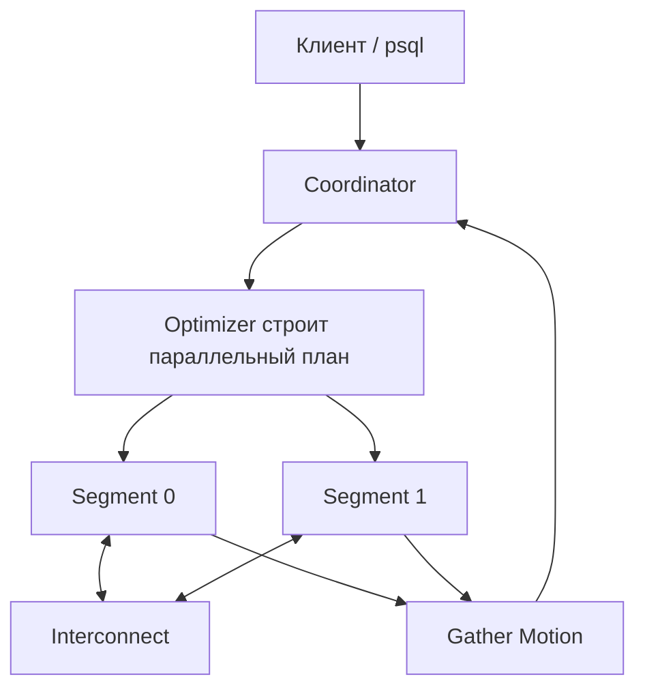
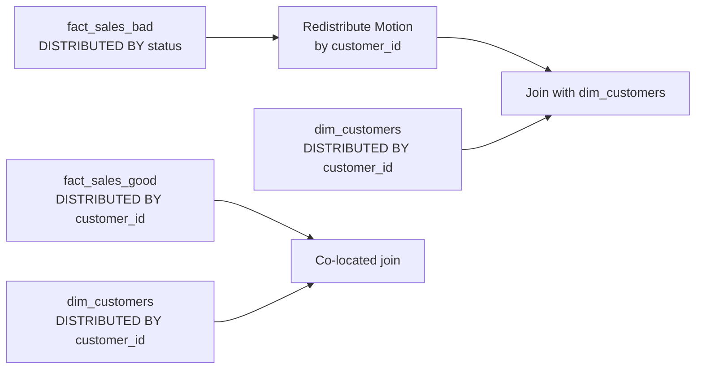

# Карта Архитектуры Greenplum

## Ментальная Модель MPP

Главная идея: coordinator управляет запросом, а данные и основная работа живут на segments. Любое движение строк между segments видно в плане как `Motion`.

## Distribution И Локальность Join

`DISTRIBUTED BY` отвечает за физическое размещение строк. Если большая fact-таблица и dimension-таблица распределены по ключу частого join, Greenplum может выполнить join локально на segments и уменьшить сетевое движение.

## Что Смотреть В EXPLAIN

| Фрагмент плана | Как читать |
|---|---|
| `Seq Scan on fact_sales_bad` | Каждый segment читает свою локальную часть таблицы. |
| `Redistribute Motion` | Строки переезжают через interconnect по новому hash key. |
| `Broadcast Motion` | Один input копируется на все segments. |
| `Gather Motion` | Финальные строки собираются на coordinator. |

## Архитектурная Эвристика

1. Сначала определи grain.
2. Найди самые большие fact-таблицы.
3. Выпиши частые joins и фильтры.
4. Проверь cardinality и риск skew.
5. Выбери distribution key под равномерность и join locality.
6. Выбери partition key отдельно под pruning и retention.
7. Подтверди решение через `EXPLAIN` и распределение строк по segments.
