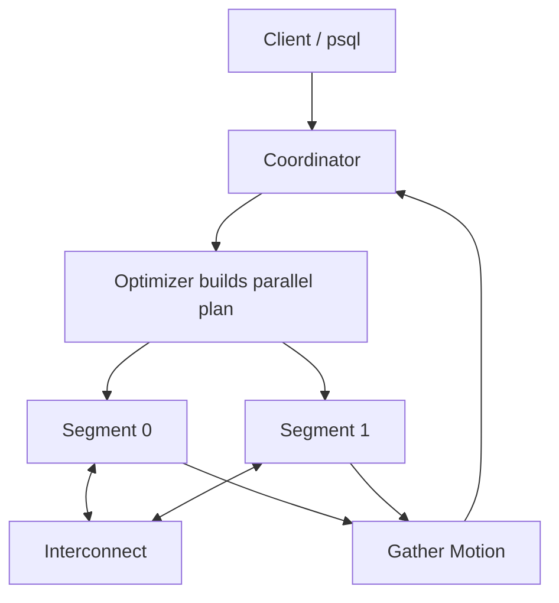
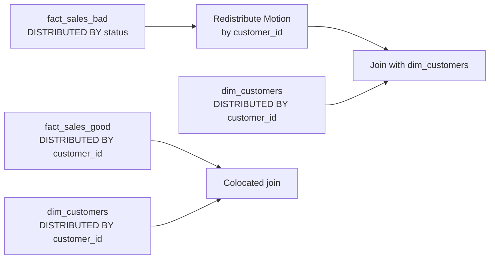

# Greenplum Architecture Map

## MPP Mental Model

## Distribution And Join Locality

## What To Look For In EXPLAIN

| Plan fragment | Interpretation |
|---|---|
| `Seq Scan on fact_sales_bad` | Each segment scans its local slice. |
| `Redistribute Motion` | Rows move across the interconnect by a new hash key. |
| `Broadcast Motion` | A relation is copied to every segment. |
| `Gather Motion` | Final rows return to coordinator. |

## Architect's Heuristic

1. Define grain.
2. Identify largest facts.
3. List frequent joins.
4. Check cardinality and skew risk.
5. Choose distribution key.
6. Choose partition key separately.
7. Validate with `EXPLAIN` and segment distribution.

