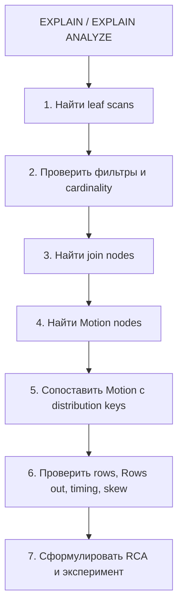

# Deep Dive: Как Читать EXPLAIN В Greenplum

Этот материал нужен как advanced-track к первому уроку. В основном маршруте ученик должен увидеть `Motion`; здесь он учится читать план системно и объяснять, почему план физически дорогой.

## plan-reading ladder

Читай план снизу вверх, но объясняй сверху вниз:

1. **Scan**: какие таблицы читаются, есть ли partition pruning, сколько строк ожидается.
2. **Local work**: фильтры, projection, local aggregate, local sort, local hash build.
3. **Join**: какой физический join выбран: `Hash Join`, `Nested Loop`, `Merge Join`.
4. **Motion**: где данные меняют locus: `Redistribute Motion`, `Broadcast Motion`, `Gather Motion`.
5. **Global work**: final aggregate, final sort, limit, gather на coordinator.
6. **Evidence**: в `EXPLAIN ANALYZE` сравнить estimated rows, actual rows, `Rows out`, время и skew по сегментам.

В Greenplum `Motion` также является границей исполнения: план режется на `slice`, а каждый executable slice исполняется своим gang-процессов на segments. Поэтому вопрос "где Motion?" почти всегда превращается в вопрос "где заканчивается локальная работа и начинается межсегментная передача?".

## Карта Чтения



## На Что Смотреть В Первую Очередь

| Признак | Что значит | Вопрос ученику |
|---|---|---|
| `Seq Scan` на большой таблице | Полное чтение сегментной части таблицы. | Есть ли pruning или фильтр по partition key? |
| `Hash Join` | Inner side строится в hash table, outer side probe-ит hash table. | Какая сторона build, поместится ли она в memory? |
| `Redistribute Motion` | Строки хэшируются по новому ключу и едут segment-to-segment. | Почему текущий distribution не совпал с join/aggregate key? |
| `Broadcast Motion` | Один набор строк копируется на все сегменты. | Действительно ли broadcast side маленький? |
| `Gather Motion` | Результат собирается на coordinator или single QE. | Это маленький final result или мы превращаем master в bottleneck? |
| `Rows out` | Фактический поток строк на узле в `EXPLAIN ANALYZE`. | Где оценка optimizer разошлась с фактом? |

## Практический Алгоритм

```text
Input: SQL query and EXPLAIN plan

1. Mark all table scans.
2. For every join:
   a. identify join algorithm;
   b. identify join key;
   c. compare join key with table distribution;
   d. mark required Motion above each input.
3. For every aggregate:
   a. identify group key;
   b. ask whether partial aggregate can happen locally;
   c. mark final aggregate/gather stage.
4. If EXPLAIN ANALYZE is available:
   a. compare estimated rows with actual Rows out;
   b. find the first node with explosive row growth;
   c. check whether one segment dominates runtime.
5. Write one sentence:
   "The query is expensive because <node> moves/builds <rows> due to <physical reason>."
```

## Задание Для Ученика

Выполни:

```sql
EXPLAIN ANALYZE
SELECT
    c.region,
    count(*) AS orders_count,
    sum(f.amount) AS revenue
FROM lesson01.fact_sales_bad AS f
JOIN lesson01.dim_customers AS c USING (customer_id)
GROUP BY c.region;
```

Ответь письменно:

- где в плане первый `Motion`;
- какой join выбран;
- какие строки едут по сети;
- где появляется global/final aggregate;
- какая одна правка в физической модели должна уменьшить сетевую цену.

Затем сравни:

```sql
EXPLAIN ANALYZE
SELECT
    c.region,
    count(*) AS orders_count,
    sum(f.amount) AS revenue
FROM lesson01.fact_sales_good AS f
JOIN lesson01.dim_customers AS c USING (customer_id)
GROUP BY c.region;
```

Ожидаемый вывод: не просто "план стал быстрее", а "изменился locus данных относительно join key, поэтому Motion стал другим или исчез в критическом месте".

## Mentor Rubric

Сильный ответ ученика содержит:

- направление чтения плана: снизу вверх по данным, сверху вниз по смыслу;
- различие между join algorithm и data movement;
- объяснение `Motion` через distribution/locus;
- осторожность с `Gather Motion`: маленький final result нормален, большой final result опасен;
- ссылку на измерение, а не только на мнение.
