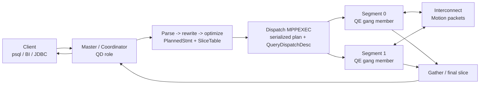
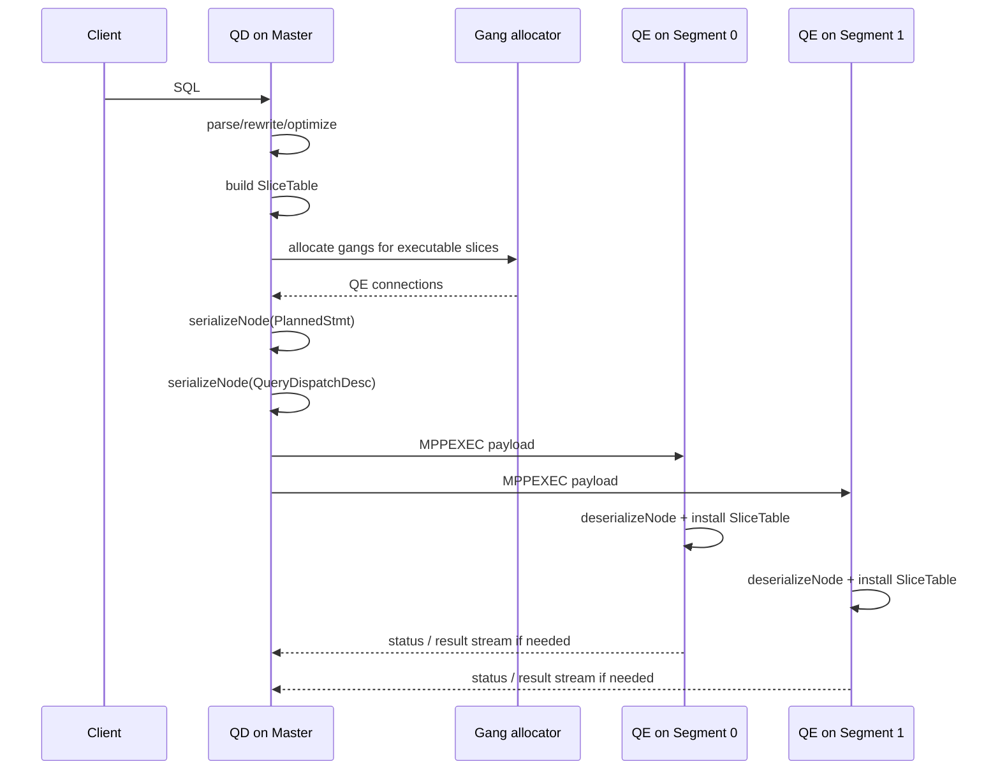
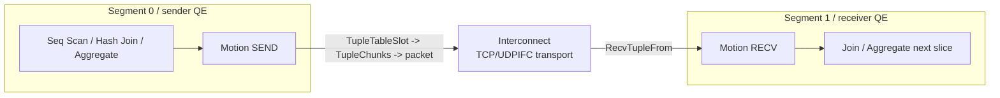
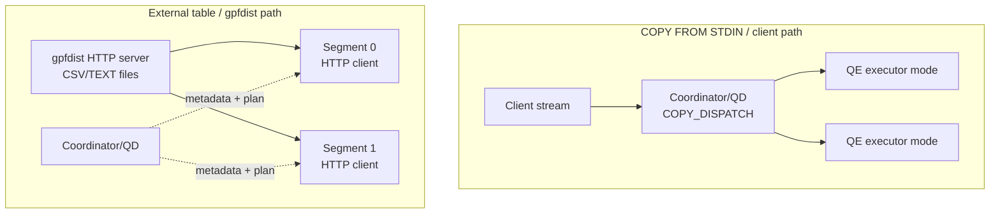
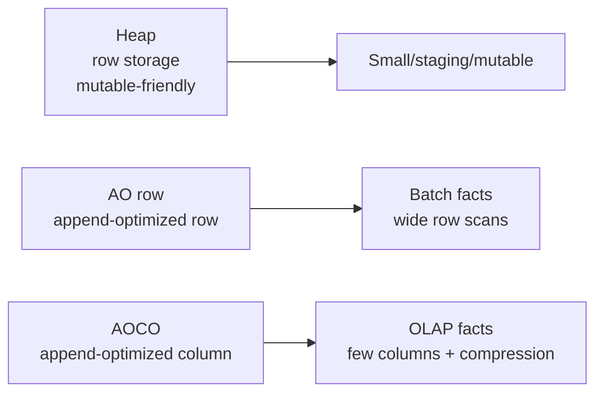

# Deep Dive: Master, Segments, QD/QE И Data Path В Greenplum

Этот материал нужен как optional depth pack: на первом уроке его можно использовать выборочно, а после урока дать ученику как самостоятельное чтение. Термины `master` и `coordinator` ниже используются как синонимы: в новых версиях чаще говорят coordinator, но в инженерной речи Greenplum до сих пор часто встречается master.

Если нужен standalone-разбор терминов QD, QE, slice, gang и Motion с аналогией, `EXPLAIN`-примером и контрольными вопросами, начни с `deep-dives/qd-qe-gang-slices-explained.md`, а затем возвращайся сюда за деталями dispatch path и data path.

## Словарь

| Термин | Что означает | Почему важно |
| --- | --- | --- |
| Master / Coordinator | PostgreSQL-подобный entry point к кластеру. Принимает клиентские подключения, хранит metadata/catalog, планирует и dispatch-ит запросы. | Хороший control plane, но плохая "труба" для больших данных. |
| QD, Query Dispatcher | Роль процесса на master/coordinator при параллельном запросе. | Создает slice table, dispatch payload и управляет QEs. |
| QE, Query Executor | Backend-процесс на segment, исполняющий назначенный slice. | Именно QE читает локальные данные, делает join/aggregate/scan и участвует в Motion. |
| Slice | Часть плана между Motion nodes. | По slices Greenplum понимает, какие gang-процессы нужны и где исполнять работу. |
| Gang | Группа QE-процессов, обычно по одному или нескольку на segment. | Gang исполняет slice параллельно. |
| Motion | Узел плана, который двигает строки между QEs или собирает результат на QD. | Главный маркер сетевой цены запроса. |
| Interconnect | Runtime-сетевой слой для Motion. | Через него идет segment-to-segment data movement. |
| gpfdist | Параллельный file distribution HTTP-сервис для external tables. | Позволяет сегментам читать/писать данные напрямую, обходя master как data pipe. |

## Верхнеуровневая Архитектура Запроса



Главная мысль для ученика: master управляет запросом и собирает финальный результат, но основная работа с user data должна происходить на segments.

## Почему Master Может Быть Узким Горлышком

Master становится bottleneck, когда через него пытаются прогнать data plane:

- большой `COPY FROM STDIN`, где клиентский поток приходит на coordinator;
- большой `COPY TO STDOUT`, где coordinator получает данные от segments и отправляет клиенту;
- слишком большой final result после `Gather Motion`;
- много одновременных клиентов, которые создают нагрузку на parsing/planning/dispatch/catalog;
- skew или плохой plan, из-за которого один segment тормозит всех, а master долго держит ресурсы сессии.

Master не должен становиться "центральным ETL-сервером". Для больших потоков лучше строить путь, где segments сами читают или пишут данные параллельно.

## QD/QE Dispatch: Что Происходит Внутри



Упрощенный алгоритм:

```text
QD:
  plan = optimize(sql)
  slice_table = InitSliceTable(plan)
  if slice requires QE:
      allocate gang
      payload.plan = serializeNode(plan)
      payload.dispatch_desc = serializeNode(QueryDispatchDesc)
      payload.dtx = serialize distributed transaction context
      dispatch MPPEXEC(payload) to QE gang

QE:
  payload = receive MPPEXEC
  plan = deserializeNode(payload.plan)
  dispatch_desc = deserializeNode(payload.dispatch_desc)
  install slice table
  execute assigned slice
```

Техническая деталь по сериализации: в GPDB source `serializeNode()` превращает plan/query tree в binary string. Если сборка поддерживает `USE_ZSTD`, этот binary string сжимается ZSTD перед отправкой на QEs; на QE `deserializeNode()` сначала распаковывает ZSTD frame, затем восстанавливает node tree.

Source anchors для самостоятельного чтения:

- `/tmp/gpdb-source/src/backend/cdb/dispatcher/cdbdisp_query.c`: build/dispatch payload, `serializedPlantree`, `serializedQueryDispatchDesc`.
- `/tmp/gpdb-source/src/backend/cdb/cdbsrlz.c`: `serializeNode()`, `deserializeNode()`, ZSTD compression/decompression.
- `/tmp/gpdb-source/src/include/executor/execdesc.h`: `ExecSlice`, `QueryDispatchDesc`.
- `/tmp/gpdb-source/src/backend/executor/execMain.c`: dispatcher/execute role handling and Motion layer setup.

## Как Данные Передаются Между Сегментами



Motion routing:

```text
if motion_type == GATHER:
    targetRoute = 0
elif motion_type == BROADCAST:
    targetRoute = all receiver routes
elif motion_type == HASH:
    targetRoute = evalHashKey(distribution expressions)
elif motion_type == EXPLICIT:
    targetRoute = segment id from target column

SendTuple(motionID, tuple_slot, targetRoute)
```

Tuple transfer flow:

```text
TupleTableSlot
  -> SerializeTuple(...)
  -> TupleChunk list
  -> interconnect packet
  -> RecvTupleFrom(...)
  -> reassemble chunks
  -> MinimalTuple
  -> parent executor node
```

Полезная nuance: это runtime-сериализация tuples для interconnect, а не storage compression AO/AOCO. Сжатие plan dispatch через ZSTD и compression table storage через `compresstype` - разные механизмы.

Source anchors:

- `/tmp/gpdb-source/src/backend/executor/nodeMotion.c`: `doSendTuple()`, `ExecMotion()`, sender/receiver branches.
- `/tmp/gpdb-source/src/backend/cdb/motion/tupser.c`: `SerializeTuple()`, `CvtChunksToTup()`.
- `/tmp/gpdb-source/src/include/cdb/ml_ipc.h`: packet contains one or more serialized `TupleChunks`.
- `/tmp/gpdb-source/src/backend/cdb/motion/ic_udpifc.c`: UDPIFC packet/ack/retry mechanics.

## COPY Через Master И Альтернативный Parallel Data Path



`COPY FROM STDIN` удобен для небольших загрузок и developer workflows, но поток идет через клиентское соединение к coordinator. В исходниках COPY прямо описывает dispatcher mode: QD читает из file/client и forwards data to QEs, а executor mode на QE получает pre-processed data от QD и вставляет в таблицу.

`gpfdist` меняет data path: это HTTP-сервер, к которому segments подключаются параллельно. Master хранит external table metadata, строит plan и dispatch-ит query, но payload CSV/TEXT не обязан идти через master.

Readable gpfdist protocol:

```text
Segment -> gpfdist HTTP GET
Headers:
  X-GP-XID
  X-GP-CID
  X-GP-SN
  X-GP-SEGMENT-ID
  X-GP-SEGMENT-COUNT
  X-GP-PROTO
  X-GP-CSVOPT
  X-GP-ZSTD optional path

Protocol 0:
  raw file content

Protocol 1:
  message = type(1 byte) + length(4 bytes network order) + content
  types: F filename, O offset, D data, E error, L line number
  stream terminates with D length 0
```

Практический вывод:

- `COPY` через client/QD: проще, но coordinator/client channel может стать bottleneck.
- `gpfdist` readable external table: segments читают параллельно как HTTP clients.
- writable external table: segments могут писать наружу параллельно, вместо того чтобы собирать все через master.
- PXF/HDFS/S3-подобные paths работают по той же архитектурной идее: master управляет, segments двигают данные.

Source anchors:

- `/tmp/gpdb-source/src/include/commands/copy.h`: COPY direct/dispatcher/executor modes.
- `/tmp/gpdb-source/src/bin/gpfdist/gpfdist.c`: `X-GP-PROTO`, protocol 0/1, headers, optional `X-GP-ZSTD`.
- `/tmp/gpdb-source/src/backend/access/external/url_curl.c`: segment-side curl path and ZSTD hooks for external table URLs.

## Heap Vs AO Row Vs AOCO Column



| Storage | Как создать | Когда выбирать | Что помнить |
| --- | --- | --- | --- |
| Heap | `CREATE TABLE ...` без AO options. | Малые таблицы, staging, mutable workloads, частые point updates/deletes. | Row-oriented, привычнее PostgreSQL, но не лучший вариант для больших scan-heavy facts. |
| AO row | `WITH (appendoptimized=true, orientation=row)` | Большие batch-loaded таблицы, где часто читается большая часть строки. | Append-optimized, compression доступен через AO options. |
| AOCO column | `WITH (appendoptimized=true, orientation=column)` | OLAP-факты, витрины, партиции с чтением подмножества колонок. | Column-level compression, меньше I/O, но хуже для частых row-by-row mutations. |

Примеры DDL:

```sql
CREATE TABLE fact_heap (...)
DISTRIBUTED BY (customer_id);

CREATE TABLE fact_ao (...)
WITH (appendoptimized=true, orientation=row,
      compresstype=zstd, compresslevel=1, blocksize=32768)
DISTRIBUTED BY (customer_id);

CREATE TABLE fact_aoco (
    sale_dt date,
    customer_id bigint,
    amount numeric ENCODING (compresstype=zstd, compresslevel=3)
)
WITH (appendoptimized=true, orientation=column,
      compresstype=zstd, compresslevel=1)
DISTRIBUTED BY (customer_id);
```

Compression notes:

- `compresstype`: обычно `zstd`, также встречаются `zlib`, `rle_type`, `none`; `quicklz` зависит от версии/дистрибутива.
- `compresslevel`: для `zstd` в документации Greenplum указывается диапазон 1-19, для `zlib` 1-9; `rle_type` применяется для column-oriented tables.
- `blocksize`: размер блока AO storage, кратный 8192; большие blocks улучшают scan/compression, но повышают memory pressure.
- `ENCODING` может задаваться на уровне колонки, что особенно полезно для AOCO.

Практическое правило для первого урока: сначала выбери grain и distribution, затем storage. Columnstore не спасает плохой distribution key и не отменяет skew.

## Что Проверить Руками В Лаборатории

```sql
-- 1. Где фактически лежат строки
SELECT gp_segment_id, count(*)
FROM lesson.fact_sales_good
GROUP BY gp_segment_id
ORDER BY gp_segment_id;

-- 2. Есть ли Motion
EXPLAIN
SELECT c.region, sum(f.amount)
FROM lesson.fact_sales_good f
JOIN lesson.dim_customers c USING (customer_id)
GROUP BY c.region;

-- 3. Какой storage у таблицы
\d+ lesson.fact_sales_good
```

Обсуждение с учеником:

- Что в плане является control plane, а что data plane?
- Почему `Gather Motion` может быть нормальным, а огромный final result - проблемой?
- Почему `COPY FROM STDIN` не лучший path для терабайтных загрузок?
- Когда AOCO ускорит запрос, а когда добавит сложность?
