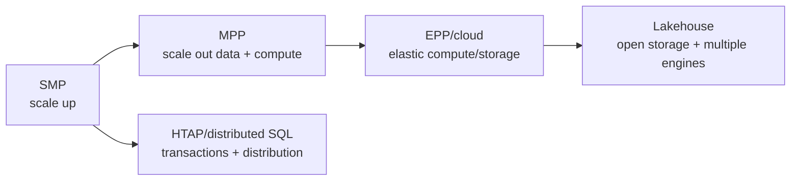

# Deep Dive: SMP, MPP, EPP, Lakehouse И Другие Архитектуры

Этот блок нужен, чтобы ученик не воспринимал Greenplum как изолированный продукт. Он должен понимать, какую цену платят разные классы систем: CPU, memory, storage, network, elasticity, operations и predictability.

## trade-off matrix

| Тип | Модель ресурсов | Сильные стороны | Слабые стороны | Типовые системы |
|---|---|---|---|---|
| SMP | Один большой сервер, общая память, общий storage. | Простая модель выполнения, меньше сетевой физики. | Вертикальный предел, дорогие scale-up апгрейды. | PostgreSQL, Oracle single instance, SQL Server single node. |
| Shared-disk cluster | Несколько compute nodes, общий storage. | HA и масштабирование compute для части workloads. | Storage/interconnect contention, сложная координация locks/cache. | Oracle RAC-подобные системы. |
| MPP shared-nothing | Каждый segment/node владеет своей частью данных и CPU. | Горизонтальная аналитика, предсказуемый scan больших фактов. | Distribution design, skew, Motion, rebalancing. | Greenplum, Teradata, Vertica, Redshift-подобные DWH. |
| EPP / cloud elastic | Compute и storage часто разделены, кластеры могут быстро меняться. | Elasticity, pay-per-use, independent scaling. | Cost governance, remote storage latency, shuffle cost. | Snowflake/BigQuery-подобные модели, cloud DWH. |
| Lakehouse | Storage в object store, compute engines читают открытые table formats. | Дешевое хранение, open formats, multi-engine access. | Metadata, small files, compaction, governance, shuffle. | Iceberg/Delta/Hudi + Spark/Trino/Flink. |
| HTAP / distributed SQL | SQL + transactional semantics на distributed storage. | Operational analytics ближе к OLTP. | Сложный consensus/replication cost, не всегда лучший DWH scan. | CockroachDB/Yugabyte/TiDB-подобные системы. |

## Простая Карта

## Как Это Связано С Greenplum

Greenplum - MPP shared-nothing система. Это означает:

- данные физически распределены между segments;
- `DISTRIBUTED BY` влияет на join locality и aggregate locality;
- master/coordinator не должен становиться data plane;
- network/interconnect является частью query plan;
- хороший SQL без хорошей физической модели может быть дорогим.

## Где У Каждого Типа Своя Цена

| Вопрос | SMP | MPP | EPP / cloud | Lakehouse |
|---|---|---|---|---|
| Где bottleneck? | CPU/RAM/IO одного сервера. | Skew, network Motion, slow segment. | Remote storage, shuffle, warehouse sizing. | Metadata, object-store IO, small files, shuffle. |
| Как масштабировать? | Больше сервер. | Больше segments/nodes + redistribute data. | Больше/меньше compute pools. | Больше compute engines, compaction/layout. |
| Что проектирует DE? | Индексы, partitions, vacuum/statistics. | Distribution, partitions, storage, statistics. | Clustering/layout, warehouse size, cost policy. | File size, partitioning, clustering, compaction. |
| Главный учебный рефлекс | Не убить single-node ресурс. | Не двигать лишние данные по сети. | Не платить за лишний scan/shuffle. | Не превратить object store в мелкофайловый хаос. |

## Задание: Архитектурный Выбор

Дай ученику три коротких сценария и попроси выбрать тип системы:

1. 2 TB данных, один сильный сервер, команда маленькая, latency важнее эластики.
2. 200 TB фактов, стабильные nightly loads, тяжелые joins и predictable BI.
3. Петабайтный data lake, много команд, Spark/Trino/ML, данные должны жить в открытом формате.

Ожидаемый ответ:

- сценарий 1 тянет к SMP/PostgreSQL или single-node DWH;
- сценарий 2 тянет к MPP/Greenplum-подобному подходу;
- сценарий 3 тянет к lakehouse/EPP, но с дисциплиной table layout и compaction.

## Advanced Вопросы

- Почему MPP не отменяет modeling, а делает его физическим?
- Почему EPP удобнее в elasticity, но сложнее в cost attribution?
- Почему lakehouse выигрывает в storage openness, но проигрывает без compaction и metadata discipline?
- Почему shared-disk решает не те проблемы, что shared-nothing MPP?

