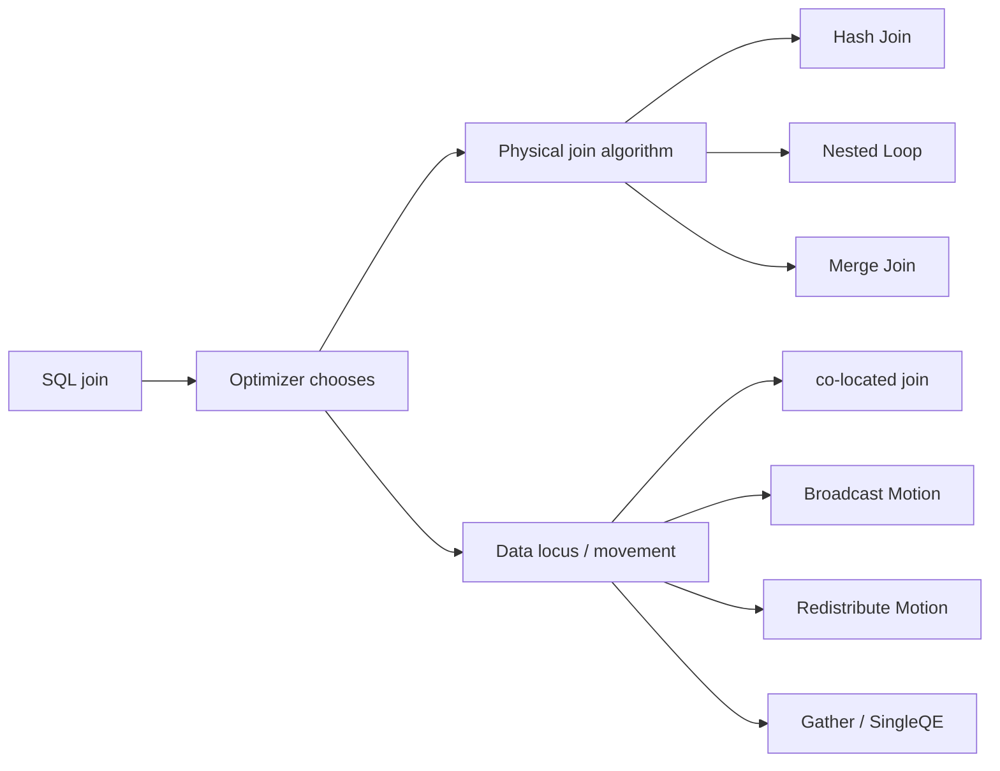

# Deep Dive: Физические Joins В Greenplum MPP

Главная мысль: `Hash Join`, `Nested Loop` и `Merge Join` описывают **локальный алгоритм соединения строк**, а `Broadcast Motion`, `Redistribute Motion` и co-located join описывают **где должны оказаться строки перед этим алгоритмом**. В MPP эти две оси нельзя смешивать.

## Две Оси Join-Плана



## Локальные Алгоритмы Join

| Algorithm | Как работает внутри QE | Когда полезен | Риск |
|---|---|---|---|
| `Hash Join` | Build hash table на inner side, затем probe outer side. | Равенство по ключу, большие факты, типичный OLAP. | Spill в workfiles, если build side не помещается в память. |
| `Nested Loop` | Для каждой outer row перечитывает или переиспользует inner path. | Очень маленький outer или index lookup. | В MPP опасен, если под ним есть Motion: может де-пайплайнить выполнение. |
| `Merge Join` | Оба входа отсортированы по join key, строки идут синхронно. | Уже отсортированные данные или полезный sort order. | Сортировки и сохранение порядка могут стоить дороже hash. |

## MPP Варианты Размещения Данных

| Pattern | Что происходит | Когда это хорошо | Как увидеть |
|---|---|---|---|
| co-located join | Оба входа уже распределены по join key на одинаковые segments. | Большой fact + большая dimension/fact по одному ключу. | Join идет без `Redistribute Motion` между входами. |
| Broadcast Motion | Маленький input копируется на все segments. | Маленькая dimension, фильтр дал мало строк. | В плане виден `Broadcast Motion`. |
| Redistribute Motion one side | Один input хэшируется по join key и переезжает. | Одна сторона дешевле для shuffle. | `Redistribute Motion` над одним input. |
| Redistribute Motion both sides | Оба input приводятся к общему locus. | Нет подходящего distribution ни у одной стороны. | Два Motion перед join. |
| Gather / SingleQE join | Данные собираются в один процесс. | Очень маленький результат или особый semantic case. | `Gather Motion`, `SingleQE`, bottleneck locus. |

## Технический Путь В GPDB

На уровне planner Greenplum хранит у path понятие locus: где физически находятся строки. Функция `cdbpath_motion_for_join()` в `src/backend/cdb/cdbpath.c` решает, где выполнять join, и добавляет Motion paths, если входы нужно привести к join locus. В source comments рядом с этой функцией прямо сформулировано: она решает, где делать join, и добавляет Motion над subpaths при необходимости.

Важные source anchors:

- [cdbpath.c:1277-1304](https://github.com/PaulKov/gpdb/blob/482967c1b49028cf072c15935462f75bc3e4b045/src/backend/cdb/cdbpath.c#L1277-L1304) - `cdbpath_motion_for_join()`, выбор места join и Motion.
- [joinpath.c:2153-2167](https://github.com/PaulKov/gpdb/blob/482967c1b49028cf072c15935462f75bc3e4b045/src/backend/optimizer/path/joinpath.c#L2153-L2167) - `select_cdb_redistribute_clauses()`, выбор equijoin clauses, пригодных для redistribution.
- [pathnode.c:466-548](https://github.com/PaulKov/gpdb/blob/482967c1b49028cf072c15935462f75bc3e4b045/src/backend/optimizer/util/pathnode.c#L466-L548) - проверка `CdbPathLocus` и сохранение paths с разным locus в upper planner.
- [cdbpathtoplan.c:23-87](https://github.com/PaulKov/gpdb/blob/482967c1b49028cf072c15935462f75bc3e4b045/src/backend/cdb/cdbpathtoplan.c#L23-L87) - преобразование `CdbPathLocus` в executor `Flow`.
- [nodeHashjoin.c:128-230](https://github.com/PaulKov/gpdb/blob/482967c1b49028cf072c15935462f75bc3e4b045/src/backend/executor/nodeHashjoin.c#L128-L230) - state machine `Hash Join`.
- [nodeHashjoin.c:1459-1515](https://github.com/PaulKov/gpdb/blob/482967c1b49028cf072c15935462f75bc3e4b045/src/backend/executor/nodeHashjoin.c#L1459-L1515) - spill tuple format: hash value + `MinimalTuple`.
- [nodeNestloop.c:39-115](https://github.com/PaulKov/gpdb/blob/482967c1b49028cf072c15935462f75bc3e4b045/src/backend/executor/nodeNestloop.c#L39-L115) - nested loop и MPP-комментарий про Motion ниже join.
- [nodeMergejoin.c:632-705](https://github.com/PaulKov/gpdb/blob/482967c1b49028cf072c15935462f75bc3e4b045/src/backend/executor/nodeMergejoin.c#L632-L705) - merge join state machine и MPP-комментарий про Motion.

## Алгоритм Мышления

```text
For each join in plan:
  identify join key
  identify distribution key of each input
  if both inputs are distributed by same join key:
      expect co-located join
  else if one input is small enough:
      expect Broadcast Motion of small side
  else if one side can be cheaper to move:
      expect Redistribute Motion of that side
  else:
      expect Redistribute Motion of both sides or SingleQE fallback

Then read the local algorithm:
  Hash Join => memory/build side/spill risk
  Nested Loop => repeated inner execution, dangerous with Motion below
  Merge Join => sort/order preservation cost
```

## Задания

### Task A: Co-Located Join

```sql
EXPLAIN
SELECT c.region, sum(f.amount)
FROM lesson01.fact_sales_good AS f
JOIN lesson01.dim_customers AS c USING (customer_id)
GROUP BY c.region;
```

Объясни:

- почему `customer_id` делает join локальным кандидатом;
- какой `Motion` остается из-за aggregate/final result;
- где физически исполняется `Hash Join`.

### Task B: Redistribute Join

```sql
EXPLAIN
SELECT c.region, sum(f.amount)
FROM lesson01.fact_sales_bad AS f
JOIN lesson01.dim_customers AS c USING (customer_id)
GROUP BY c.region;
```

Объясни:

- почему `DISTRIBUTED BY(status)` конфликтует с `JOIN USING(customer_id)`;
- какие строки переезжают;
- почему low-cardinality key одновременно создает skew и плохой join locus.

### Task C: Второй Join Key

```sql
EXPLAIN
SELECT p.category, sum(f.amount)
FROM lesson01.fact_sales_good AS f
JOIN lesson01.dim_products AS p USING (product_id)
GROUP BY p.category;
```

Объясни, почему исправление под `customer_id` не делает все joins локальными. Это хорошая точка для архитектурного разговора: один distribution key оптимизирует главный паттерн, а не весь мир.

## Профессиональный Вывод

В Greenplum нельзя сказать "у нас Hash Join, значит все хорошо". Надо сказать полную фразу:

> План делает `Hash Join` после `Redistribute Motion`, потому что физический locus входов не совпадает с join key. Риск состоит в сетевой цене, skew и возможном spill build side.
