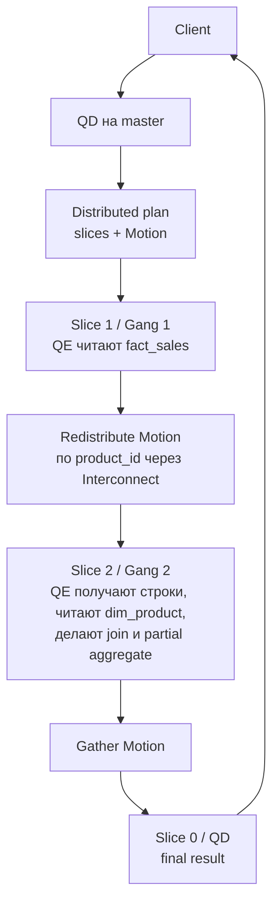

# Deep Dive: QD, QE, Slices, Gangs И Motion В Greenplum

Этот материал объясняет внутреннюю механику distributed execution в Greenplum. Его удобно дать ученику перед appendix-слайдами 24-30 или после урока как самостоятельное чтение.

Самая короткая связка:

```text
QD  = Query Dispatcher на master
QE  = Query Executor на segment
Slice = кусок distributed execution plan
Gang = группа QE-процессов, исполняющая один slice
Motion = граница между slice'ами, где данные едут по interconnect
```

## 1. QD

**QD**, Query Dispatcher, — это backend-процесс на master/coordinator, который обслуживает пользовательский запрос.

Короткая формулировка: QD — это backend-процесс на master/coordinator.

Когда клиент подключается к Greenplum master и отправляет SQL, master принимает, парсит и оптимизирует запрос, а затем распределяет параллельный план по segment instances. Segment'ы выполняют локальные операции над своей частью данных.

QD делает примерно это:

```text
1. принимает SQL от клиента
2. парсит / планирует / оптимизирует
3. строит distributed plan
4. делит plan на slices
5. создает или переиспользует gangs QE-процессов
6. отправляет работу на segments
7. координирует execution
8. собирает финальный результат, если в плане есть gather/final slice
9. возвращает результат клиенту
```

То есть QD — это **дирижер запроса**.

Важно: QD обычно **не читает основную пользовательскую таблицу сам**. Основная работа делается на segment'ах. Но финальная агрегация, сортировка или сбор результата может происходить на QD, если план приводит данные в single-node locus.

## 2. QE

**QE**, Query Executor, — это worker/backend-процесс на segment instance.

Короткая формулировка: QE — это worker/backend-процесс на segment instance.

В документации Greenplum рабочий процесс запроса на master называется QD, а на segment'ах — QE. QE выполняет свою часть работы и обменивается промежуточными результатами с другими worker-процессами через interconnect.

QE делает:

```text
scan local table partitions
filter
join
aggregate
sort
send rows через Motion
receive rows через Motion
write data при INSERT / CTAS / CREATE TABLE AS SELECT
```

Если в кластере 48 primary segments, то для обычного full parallel scan может быть примерно:

```text
1 QD на master
+
48 QE на segments
```

Для сложного запроса может быть не один набор QE, а несколько, потому что появляются **slices** и **gangs**.

## 3. Slice

**Slice** — это логический фрагмент execution plan, который Greenplum может исполнять независимо на segment'ах.

Главная причина появления нового slice — **Motion**.

Motion — это операция перемещения строк:

```text
Redistribute Motion
Broadcast Motion
Gather Motion
```

Greenplum режет план на slices в местах, где данные должны переехать между segment'ами. Если в плане есть Motion, producer-часть и consumer-часть становятся разными фрагментами distributed execution.

Пример:

```sql
SELECT c.customer_id, sum(o.amount)
FROM orders o
JOIN customers c ON o.customer_id = c.customer_id
GROUP BY c.customer_id;
```

Допустим:

```text
orders     distributed by order_id
customers  distributed by customer_id
```

Join идет по `customer_id`, но `orders` распределены по `order_id`. Значит, строки `orders` надо перегнать на нужные сегменты по `customer_id`.

Концептуально план становится таким:

```text
Slice 1:
  scan orders
  redistribute orders by customer_id
        |
        | Redistribute Motion
        v
Slice 2:
  receive redistributed orders
  scan customers locally
  join
  aggregate
        |
        | Gather Motion
        v
Slice 0 / root:
  collect result on QD
  return to client
```

То есть **slice — это не процесс**, а часть плана.

Близкая аналогия:

```text
Spark stage ≈ Greenplum slice
```

Аналогия не идеальная, но полезная: граница возникает там, где нужен data exchange.

## 4. Gang

**Gang** — это уже физическое исполнение slice.

Короткая формулировка: Gang — это уже физическое исполнение slice.

Если slice должен выполняться на 48 segment'ах, Greenplum создает или переиспользует группу из 48 QE-процессов. Эта группа и называется **gang**.

Связанные QE-процессы, которые работают над одним и тем же slice query plan, но находятся на разных segment'ах, образуют gang. Данные текут от одного gang процессов к следующему через Greenplum Interconnect.

Пример:

```text
Slice 1 исполняется gang #1:
  QE seg0
  QE seg1
  QE seg2
  ...
  QE seg47

Slice 2 исполняется gang #2:
  QE seg0
  QE seg1
  QE seg2
  ...
  QE seg47
```

Если запрос сложный и в нем много Motion, то может быть много slices, а значит и много gangs.

Коротко:

| Термин | Что это |
| --- | --- |
| **QD** | Процесс-диспетчер на master/coordinator. |
| **QE** | Процесс-исполнитель на segment. |
| **Slice** | Логический кусок distributed plan. |
| **Gang** | Физическая группа QE для исполнения slice. |
| **Motion** | Пересылка данных между slices/gangs. |

## Как они работают вместе

Представь запрос:

```sql
SELECT d.category, sum(f.amount)
FROM fact_sales f
JOIN dim_product d ON f.product_id = d.product_id
GROUP BY d.category;
```

Если таблицы не co-located, Greenplum может сделать так:



Тот же поток в короткой текстовой форме:

```text
Client
  |
  v
QD на master
  |
  | строит distributed plan
  v

Slice 1 / Gang 1:
  QE на каждом segment читает fact_sales
  QE перераспределяет строки по product_id
  |
  | Redistribute Motion через Interconnect
  v

Slice 2 / Gang 2:
  QE на каждом segment получает нужные строки
  QE читает локальную часть dim_product
  QE делает join
  QE делает partial aggregate
  |
  | Gather Motion
  v

Slice 0 / QD:
  собирает финальный результат
  возвращает клиенту
```

Внутри Greenplum это выглядит примерно так:

```text
QD
 ├── dispatch Slice 1 -> Gang 1 -> QE/QE/QE/...
 ├── dispatch Slice 2 -> Gang 2 -> QE/QE/QE/...
 └── collect final result
```

## Как это видно в EXPLAIN

В `EXPLAIN` / `EXPLAIN ANALYZE` нужно смотреть на `Motion` и `sliceN`.

Упрощенный пример:

```text
Gather Motion 48:1  (slice2; segments: 48)
  -> HashAggregate
      -> Hash Join
          -> Redistribute Motion 48:48  (slice1; segments: 48)
              -> Seq Scan on fact_sales
          -> Seq Scan on dim_product
```

Как читать:

```text
Gather Motion 48:1
```

Данные собираются с 48 segment workers в 1 получатель, часто QD.

```text
Redistribute Motion 48:48
```

Данные перераспределяются между 48 sender QE и 48 receiver QE.

```text
(slice1; segments: 48)
```

Эта часть плана — отдельный slice, который исполняется на 48 сегментах.

## Почему это важно для производительности

Чем больше `Motion`, тем больше slices.

Чем больше slices, тем больше gang'ов, QE-процессов, interconnect-обмена и потенциального расхода памяти.

В контексте `gp_max_slices` slice можно мыслить как subset query plan, который segment может исполнять независимо. Новый slice создается, когда данные должны перемещаться между segment'ами через Motion. `Redistribute Motion`, `Broadcast Motion` и `Gather Motion` являются типичными slice boundaries.

Плохой план с кучей movement может выглядеть так:

```text
scan
redistribute
join
redistribute
aggregate
broadcast
join
gather
```

А хороший co-located plan может быть таким:

```text
scan local
join local
aggregate local
gather final result
```

Для Greenplum это огромная разница.

Для тюнинга главный практический вывод такой: **смотри в EXPLAIN на Motion и slices**. Если видишь много `Redistribute Motion` / `Broadcast Motion`, значит запрос активно гоняет данные между gang'ами, и надо проверять distribution keys, join keys, статистику, skew и возможность co-located join.

## Самая полезная ментальная модель

```text
QD = водитель автобуса / диспетчер
QE = рабочий на конкретном segment
Slice = этап работы
Gang = бригада QE, выполняющая этап
Motion = передача деталей между бригадами
Interconnect = сеть/транспорт между QE
```

Или совсем коротко:

```text
QD планирует и координирует.
QE исполняют.
Slice — что исполнять.
Gang — кто исполняет slice.
Motion — как данные переезжают между slice'ами.
```

## Мини-Лабораторная Для Ученика

1. Запусти bad join из workbook и найди `Redistribute Motion`.
2. Выпиши `sliceN`, количество sender/receiver workers и тип Motion.
3. Объясни, какая часть плана является producer slice, а какая consumer slice.
4. Сравни с good/co-located вариантом и ответь, какой Motion исчез или стал дешевле.

Команды:

```bash
python3 mentor-lab.py hint greenplum plan-reading
python3 mentor-lab.py analyze-plan greenplum --query bad_customer_join --sample
python3 mentor-lab.py visualize-plan greenplum --query bad_customer_join --sample --format mermaid
```

## Контрольные Вопросы

1. Почему `slice` не является процессом?
2. Почему `gang` обычно масштабируется по количеству segments?
3. Почему `Redistribute Motion 48:48` не означает, что данные едут через master?
4. Когда `Gather Motion 48:1` нормален, а когда превращает coordinator в bottleneck?
5. Что проверять первым: physical join algorithm или data movement?

Ожидаемый ответ: сначала объяснить locus/data movement (`co-located`, `Broadcast Motion`, `Redistribute Motion`, `Gather Motion`), затем локальный алгоритм (`Hash Join`, `Merge Join`, `Nested Loop`).

## Связанные Материалы

- [Student workbook](https://github.com/PaulKov/de-mentor/blob/master/docs/lessons/01-greenplum/student-workbook.md) - задания 1.1, 3 и 4.
- [Deep-dive path](https://github.com/PaulKov/de-mentor/blob/master/docs/lessons/01-greenplum/runbooks/deep-dive-path.md) - маршрут, где этот материал используется на Stage 1.
- [Master/segment data path](https://github.com/PaulKov/de-mentor/blob/master/docs/lessons/01-greenplum/deep-dives/master-segment-data-path.md) - более технический разбор dispatch path, `QueryDispatchDesc`, `TupleChunks`, `gpfdist` и storage.
- [EXPLAIN plan reading](https://github.com/PaulKov/de-mentor/blob/master/docs/lessons/01-greenplum/deep-dives/explain-plan-reading.md) - ladder для чтения `EXPLAIN ANALYZE`.
- [Physical joins in MPP](https://github.com/PaulKov/de-mentor/blob/master/docs/lessons/01-greenplum/deep-dives/physical-joins-in-mpp.md) - как отделять local join algorithm от MPP data movement.

## Источники

- [Greenplum Database Docs: Parallel Query Processing](https://docs-cn.greenplum.org/v6/admin_guide/query/topics/parallel-proc.html)
- [Broadcom Support: Understanding and Managing gp_max_slices](https://knowledge.broadcom.com/external/article/430557/understanding-and-managing-gpmaxslices.html)
